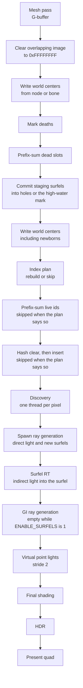
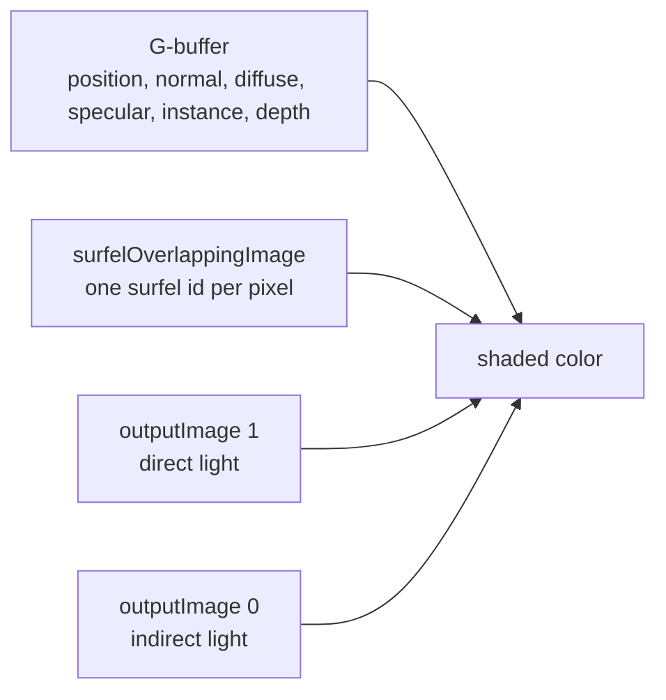

# 1. The frame

One submitted command buffer draws the mesh, builds or reuses the surfel index, lights the surfels, and composites the image. Frames in flight share the surfel buffers. The GPU orders those frames with the usual frame fences, so two GI passes do not run on the same surfel memory at once.

`gi_reuse_frames` is a CPU counter (`prev_frame_gi_reuse` in `system.rs`). It starts at 0 and increments by one after every presented frame. It is not reset when the camera moves. Passes use it as "how many frames has this view been accumulating", not as a camera-cut detector.

## Order

`ART_RTIC_STOP_AFTER` in `system.rs` can return after `mesh`, `gi`, `final`, or `hdr`. That cuts the command buffer short. It does not change the order of the passes that still run.

## What each pass is for

| Pass | Shader | Question it answers |
|---|---|---|
| Mesh | `mesh_rendering.frag` | What world position, normal, albedo, and instance is at this pixel? |
| Mark | `surfel_mark.comp` | Which committed surfels are too old, too far, or the wrong size? |
| Hole prefix | `surfel_prefix.comp` kind 0 | Where are the dead slots inside `[0, high_water)`? |
| Commit | `surfel_commit.comp` | Where do last frame's new surfels live permanently? |
| Plan | `surfel_index_plan.comp` | Did the set of live surfels change? |
| Live prefix | `surfel_prefix.comp` kind 1 | What is the compact list of live ids? |
| Hash | `surfel_keys.comp` | Which cell contains each live center? |
| Discovery | `surfel_discovery.comp` | Which committed surfel covers this pixel? |
| Spawn | `surfel_spawn.rgen` | If nothing covers it, may I create one? Also: direct light on frame 0. |
| Surfel RT | `surfel_rt.rgen` | What indirect light does this surfel gather? |
| GI raygen | `global_illumination.rgen` | Nothing, while surfels are enabled. The `#if ENABLE_SURFELS` body is empty. |
| VPL | `surfel_vpl.comp` | Which surfel would light this pixel as a point light? The result is not stored yet. |
| Final | `final_rendering.frag` | Direct image plus GI image, plus a red tint where a surfel overlaps. |
| HDR / quad | `hdr_transform`, `renderquad` | Tonemap and present. |

Hardware ray tracing against the mesh acceleration structure happens in spawn (shadow rays, frame 0 only) and in surfel RT (bounce rays). Discovery and the hash never trace rays. They only read the G-buffer and the surfel buffers.

## Images that survive the frame

The overlapping image is cleared to `0xFFFFFFFF` at the start of every GI pass. Discovery is the only writer that fills it back in. Final shading treats `0xFFFFFFFF` as "no surfel on this pixel".

Direct and indirect images are cleared only when `gi_reuse_frames == 0`. Later frames read the previous contents and blend. Spawn writes direct light only on frame 0. Surfel RT accumulates indirect light into the surfel records themselves. The GI image is what final shading samples as `gibuffer[0]`. With surfels enabled, the GI ray generator does not write that image. Indirect light reaches the picture only if some other pass stored it. Today that store is incomplete: surfel RT updates surfel irradiance, and the VPL pass computes a color it does not write. The red overlay (`SHOW_SURFELS`) is independent of that. It only tests the overlapping id.
