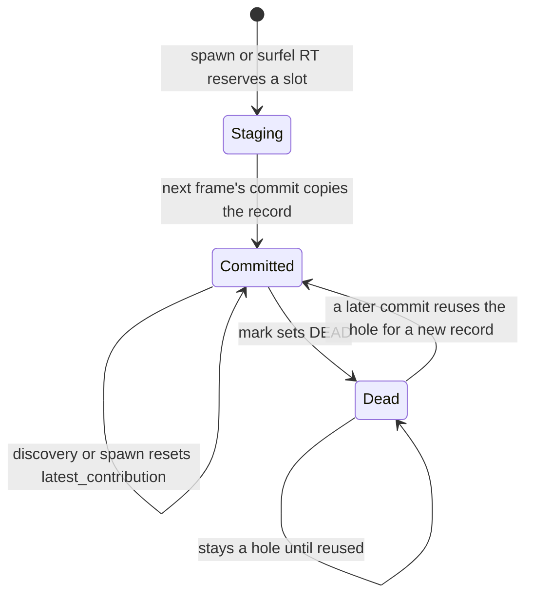

# 3. Lifetime

A surfel is born in the staging half, copied into a stable committed slot, found by the hash, and eventually marked dead. The slot index does not change between birth in the committed region and death. Nothing in the live path sorts surfel payloads.



## Mark

`surfel_mark.comp`. One thread per slot in `[0, high_water)`. Staging slots are not visited.

A thread returns immediately if the slot is already `DEAD` or not yet `READY`.

Otherwise, in order:

1. **Age.** `latest_contribution` increments by one. Discovery and a successful spawn set it back to 0 when they use the surfel. If it reaches `DELETE_NOT_CONTRIBUTING_SURFELS` (120), the slot is marked `DEAD` and `index_topology_dirty` is set. A surfel that covers no pixel for about two seconds at 60 FPS disappears.
2. **Radius.** The ideal radius is a linear map from camera distance: near plane maps to `MIN_SURFEL_RADIUS` (10), far plane maps to `MAX_SURFEL_RADIUS` (120). If the stored radius differs by more than `DELETE_ON_RADIUS_DIFFERENCE` (15), mark **writes the new radius in place**. It does not set `DEAD` and it does not set `index_topology_dirty`. The hash is not rebuilt for a radius edit. See chapter 11 for the consequence.
3. **Range.** If the distance from the eye to the center is greater than the far plane, the slot is marked `DEAD` and the index is dirty. This is a sphere around the eye, not a sliding axis-aligned box.

Mark never compacts. Dead slots remain inside `[0, high_water)` until commit reuses them.

## Hole prefix

`surfel_prefix.comp` with `kind = 0`, three dispatches separated by compute barriers.

The predicate is "slot `< high_water` and `DEAD`".

| Phase | Dispatch | Work |
|---|---|---|
| 0 | 128 groups of 256 | Each group counts its dead slots and writes a block sum. |
| 1 | 1 thread | Exclusive scan of the 128 block sums. Stores `HDR_HOLE_COUNT`. |
| 2 | 128 groups of 256 | Each dead slot writes its id into `OFF_HOLES` at its exclusive index. |

This is a standard three-kernel scan. The block sums are not read across workgroups inside one dispatch. That cross-group read is the bug that made the old radix sort flicker. The barriers between phases are the fix, and the hole scan still uses them.

## Commit

`surfel_commit.comp`. One group of 256 threads. At most 256 staging surfels exist, so one group covers the copy.

Thread 0 snapshots `high_water`, `HDR_HOLE_COUNT`, and `unordered_surfels` into shared memory. Every thread then copies one staging record:

```text
src = 32768 + lane
dst = OFF_HOLES[lane]              if lane < hole count
      high_water + lane - holes    otherwise
```

The copy is a full `Surfel` assignment, then `DEAD` is cleared on the destination. The source staging record is left behind and ignored, because `unordered_surfels` is set to 0 before anyone reads it again.

Thread 0 then publishes:

```text
appended   = how many staging surfels did not fit in holes, clamped to the room under 32768
placed     = min(staging count, holes + appended)
high_water = old high_water + appended
live_count = (old high_water - holes) + placed
remaining_holes = holes left over
unordered_surfels = 0
```

If `placed > 0`, `index_topology_dirty` is set. The hash will be rebuilt this frame, after the live-id scan, so it sees the new slots.

Commit also clears the discovered-list and the reserve counter. Those matter only when `POPULATE_VISIBLE_SURFELS_LIST` is turned on.

## Index plan

`surfel_index_plan.comp`. One thread.

```text
HDR_BUILD_ACTIVE = 1  if live_count != HDR_KEY_COUNT or index_topology_dirty != 0
                 = 0  otherwise
```

`HDR_KEY_COUNT` is the live count stored by the last hash insert. A quiet frame, with no births and no deaths, skips the live-id scan and the hash. Queries keep using the previous chains. That is safe only because centers do not move and the live set is identical.

The plan runs **before** the live-id prefix. The prefix for `kind = 1` returns immediately when `HDR_BUILD_ACTIVE` is 0, so it does not overwrite `OFF_IDS_A` while the hash still points at the old list.

## Live-id prefix

Same shader as the hole scan, `kind = 1`. The predicate is "slot `< high_water` and not `DEAD`".

Phase 1 stores the total into `live_count` again (it should match what commit wrote, modulo races that this single-queue pass does not have). Phase 2 writes the packed ids to `OFF_IDS_A`. Hash insert reads `OFF_IDS_A[0 .. live_count)`.

## What "stable index" means

```text
frame N spawn          writes surfels[32768 + k]
frame N+1 commit       copies that record to slot S in the committed half
frame N+1 hash         links S into a cell
frame N+2 .. N+k       S stays at that index, hash unchanged, until a death or a new commit
```

Do not compact the committed array. Do not swap two live surfels. Every overlapping pixel, every RT hit, and every hash node stores the slot index and expects the payload to stay there.
