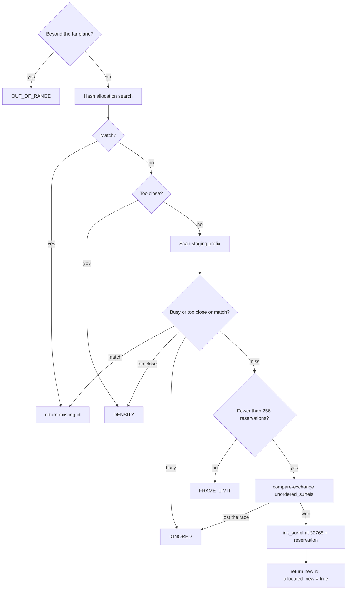

# 5. Queries

All committed-surfel lookups go through the hash in chapter 4. The functions live in `surfel.glsl`. Shaders that define `SURFEL_NO_SCRATCH` cannot see `build_words` and must not call them. Mark and commit are in that category. Discovery, spawn, surfel RT, the GI ray generator, and the VPL pass are not.

`lbvh_empty()` is a bad name kept from the tree. It is true when `live_count <= 0`. The hash probes use it as "there is nothing to find".

## Point search

`bvh_search(point)` is also a historical name. It does not walk a tree.

```text
for level in 0, 1, 2:
    base = floor(point / cell_size(level))
    for each of the 27 cells around base:
        walk that bucket's chain, at most 32 hops
        if the surfel is not DEAD and the point is inside its sphere:
            return that surfel id
return 0xFFFFFFFF
```

The first hit wins. Order is level 0 first, then the chain order, which is the reverse of insert order. Callers that only need "some surfel covering this point" can use this. Callers that also care about instance id use the allocation search instead.

`point_inside_surfel` is a squared-distance test against the stored radius. It does not look at the normal.

## Allocation search

`linear_search_ordered_surfel_for_allocation(point, instance_id, radius)` uses the same 3×3×3 probe. The name "linear" is historical. The radius argument is the radius a new surfel would have at `point`, from `radius_from_camera_distance`.

For each visited surfel that is not `DEAD`:

| Test | Result |
|---|---|
| Point is inside the sphere and `instance_id` matches | Return that surfel id immediately. |
| Distance to the center is less than `radius + surfel.radius` | Remember "too close" and keep looking. A real match later still wins. |
| Neither | Ignore. |

If the walk finishes without a match, the function returns `SURFELS_TOO_CLOSE` (`0xFFFFFFFD`) or `SURFELS_MISSED` (`0xFFFFFFFE`).

`SURFELS_TOO_CLOSE` means "do not allocate". Two spheres that would overlap are rejected so the surface does not grow a stack of surfels in the same place. The test uses the sum of radii, so it can fire for a surfel the point is not inside.

The 3×3×3 neighborhood is exact for "point inside sphere" given the level rules. It is only approximate for "too close". A neighbor just outside the sphere but inside `radius + other.radius` can sit two cells away and be missed. The result is an occasional extra surfel, not a hole. Widening the probe to 5×5×5 would close that gap and multiply the query cost by about five.

## Closest and gather

`find_closest_surfel(point)` runs the same neighborhood and keeps the smallest distance. It is not a global nearest-neighbor search. A surfel many cells away is invisible to it.

`gather_nearby_surfels(point, radius, ids)` appends up to `SURFEL_NEIGHBOR_CAP` (8) ids whose centers lie inside `radius`. Nothing in the current passes calls it. It is the hook for a later reservoir or ReSTIR gather. It has the same neighborhood limit as closest-point.

## Staging search

`linear_search_unordered_surfel_for_allocation` does not touch the hash. It reads `unordered_surfels` with an atomic load, then scans

```text
for i in [32768, 32768 + unordered_surfels):
    if READY is not set: remember BUSY, skip
    if point is inside and instance matches: return i
    if spheres would overlap: remember TOO_CLOSE
```

`READY` is published with a release store at the end of `init_surfel`. A scan that observes a reserved slot before that store returns `SURFELS_BUSY` (`0xFFFFFFFC`). The caller treats busy as "try again next pixel", not as a spin. `FORCE_ALLOCATION` is 0, so there is no retry loop.

This scan is the only reason the staging half stays dense. If reservations were scattered, the scan would have to walk the whole upper half.

## Allocation

`find_surfel_or_allocate_new` is the spawn and surfel-RT entry point.



`allocate_surfel` is one compare-exchange on `unordered_surfels`: "if the count is still the value I scanned, increment it". The returned index is the old count. The slot is `total_surfels/2 + index`. Losing the race returns `SURFELS_MISSED`, and with `FORCE_ALLOCATION` off the pixel gives up.

The capacity check before the compare-exchange uses `remaining_holes + room under the high-water mark`. Commit is what turns a reservation into a committed slot. If that sum is already exhausted, the function returns `SURFELS_FULL` and does not increment the counter.

`init_surfel` writes the payload while holding `LOCKED`, then release-stores `READY` (and `LOCKED` if `allocate_locked` is set). Spawn asks for the lock, writes direct light, then unlocks. Surfel RT does the same for bounces that allocate.

## Find without allocating

`find_committed_surfel_at` is the spawn path once `gi_reuse_frames >= 2` and discovery left the pixel empty. It runs the hash allocation search and, on a miss that was not "too close", the staging scan. It never calls `allocate_surfel`.

Pixels that spawn still covers from discovery never reach this function. Spawn returns first. See chapter 7.
