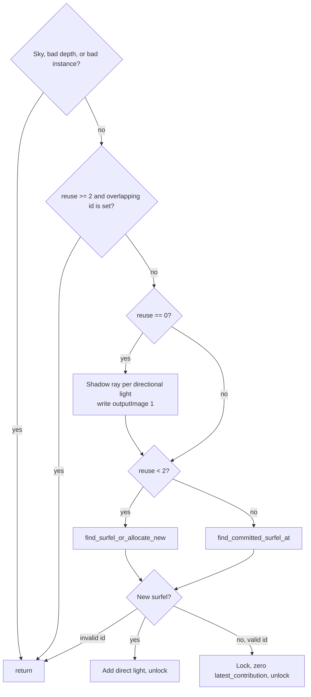

# 7. Spawn

`surfel_spawn.rgen` is a ray-generation shader launched over the full viewport (`trace_rays` with the swapchain extent). It has a closest-hit and a miss shader. Those exist to serve `traceRayEXT` for directional-light shadows. The surfel search itself is not a ray trace.

`gi_reuse_frames` changes the body. The counter only grows, so "frame 0" and "frame 1" mean the first two presented frames of the run, not the first two frames after a camera move.

## Per pixel

## Frame 0

Every shaded pixel traces up to `MAX_DIRECTIONAL_LIGHTS` (8) shadow rays from the G-buffer position along the light direction. A light whose direction is shorter than 0.4 is skipped. Rays use `gl_RayFlagsTerminateOnFirstHitEXT` and skip the acceleration structure's AABB primitives. A miss adds `max(dot(normal, light_dir), 0) * intensity` into both the direct-light image and a vector that will be given to a new surfel.

Then the pixel tries to allocate, as in chapter 5. A new surfel receives that direct-light vector through `addDirectionalLightContribution` and is unlocked. An existing surfel is locked once, has `latest_contribution` cleared, and is unlocked. A failed lock leaves the counter alone. Discovery will usually clear it anyway.

The direct-light image is what final shading adds as `gibuffer[1]`. It is written only on frame 0. Later frames keep the image because GI does not clear it when `gi_reuse_frames != 0`.

## Frame 1

No shadow rays. Allocation still runs, so a second wave of up to 256 surfels can be staged. They are committed on frame 2.

## Frame 2 and after

If discovery wrote an overlapping id, the pixel returns immediately. No hash probe, no allocation, no lock. Covered pixels are cheap.

If discovery missed, the pixel calls `find_committed_surfel_at`. That can see staging surfels created earlier in this same dispatch, but it will not create a new one. So after frame 1 the world does not gain surfels, except for allocations that `surfel_rt` still performs on `gi_reuse_frames == 0` (chapter 8). Walking into a new room later in the run does not spawn a new layer of surfels from this pass. Coverage there depends on surfels that were already committed and still inside the far-plane sphere.

That is a behavior limit, not a hash limit. Restoring allocation after frame 1 means deleting the `gi_reuse_frames < 2` branch and always calling `find_surfel_or_allocate_new`, at the cost of a hash probe plus possible atomics on every uncovered pixel.

## Hit and miss shaders

`surfel_spawn.rchit` and `surfel_spawn.rmiss` only fill `payload.hit` and the hit attributes used by the shadow test. They do not allocate surfels. Closest-hit loads the usual barycentrics, normal, and instance so the ray payload matches the other ray pipelines.
